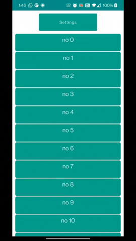

README2.

A curated list of awesome Android UI/UX libraries.

# Jetpack Compose

测试 列表

| Namemi                                             | 描述                                                         | Img                                                          | UpdateTime |
| -------------------------------------------------- | ------------------------------------------------------------ | ------------------------------------------------------------ | ---------- |
| [Landscapist                                       | Flinger is a plugin that is made on top of [`jetpack compose`](https://developer.android.com/jetpack/compose) that will help the developer to tweak the LazyList's fling behaviour. This Library will help the developers to change the fling behaviours much easier without digging deep. Here is a prototype of Flinger: |  |            |
| [Flinger](https://github.com/iamjosephmj/flinger)  | [Flinger](https://github.com/iamjosephmj/flinger)            |  |            |
| [Orchestra](https://github.com/skydoves/Orchestra) |                                                              |  |            |

