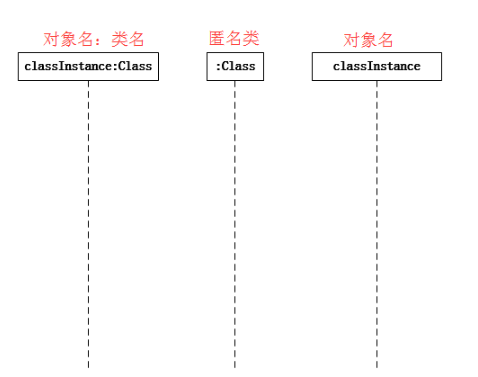
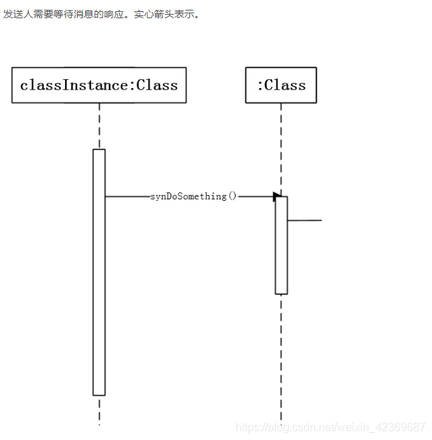
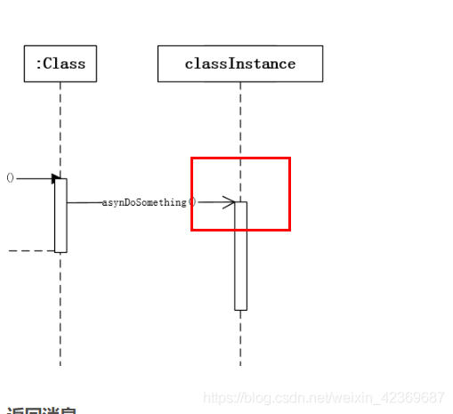
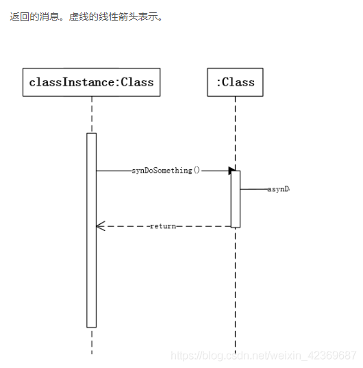
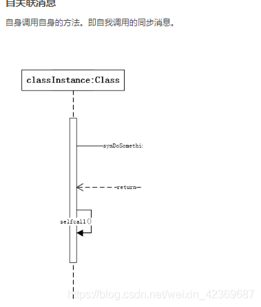
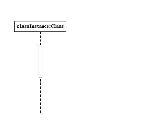
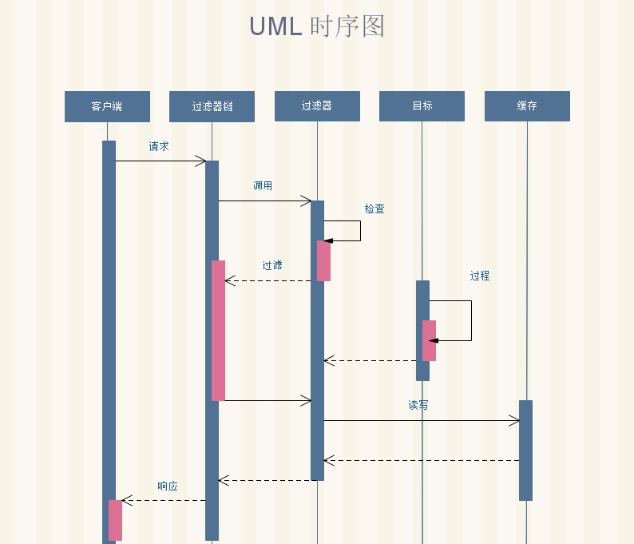
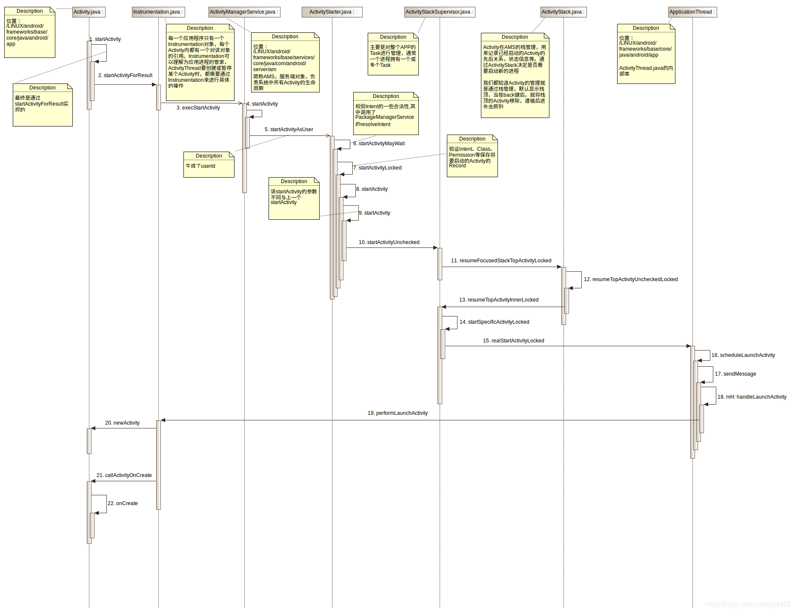

# UML图绘制-时序图的画法

### 1.什么是时序图

 时序图用于描述对象之间的**传递消息的时间顺序**, 即**用例中的行为顺序**

主要用来更直观的表现**各个对象交互的时间顺序**，将体现的重点放在 **以时间为参照，各个对象发送、接收消息，处理消息，返回消息的 时间流程顺序**，也称为时序图。

又名**序列图、循序图、顺序图**，是一种**UML交互图**

### **2.**时序图的作用：

**确认和丰富一个使用情境的逻辑，**

**尤其在分析源码过程中，掌握时序图的绘制，可以将代码调用逻辑还原，根据图形增加对调用逻辑的理解**

### 3.时序图的构成：

- **对象**: 时序图中对象使用**矩形**表示, 并且 将对象名称下有**下划线**.

  对象置于时序图的顶部说明在交互开始时对象就已经存在了.

  如果对象的位置不在顶部, 表示对象是在交互的过程中被创建的.

  也可以是系统角色，可以是人或者其他系统，子系统

  

- **生命线**: 生命线是一条**垂直的虚线**. 表示**时序图中的对象在一段生命周期内存在**. **每个对象底部中心的位置都带有生命线**.

- **消息**: 两个对象之间的**单路通信**. 从**发送方指向接收方**

-  **同步消息=调用消息**（**Synchronous Message**）：消息的发送者把控制传递给消息的接收者，**然后停止活动**，等待消息的接收者放弃或者返回控制。用来表示同步的意义

  

-  **异步消息（Asynchronous Message）**：消息发送者通过消息把信号传递给消息的接收者，**然后继续自己的活动**，不等待接受者返回消息或者控制。**异步消息的接收者和发送者是并发工作的**

  

- **返回消息（Return Message）**：返回消息表示**从过程调用返回**

  

-  **自关联消息**： 表示方法的**自身调用**以及**一个对象内的一个方法调用另外一个方法**。

  

- **激活钝化激活**表示**该对象被占用以完成某个任务**. **钝化**指**对象处于空闲状态**, **等待消息**. **在 UML 中, 对象激活时将对象的生命线拓宽为矩形来表示的. 矩形称为计划条或控制期**

  

- **对象的创建和销毁**: 在时序图中, **对象的默认位置是在图的顶部. 这说明对象在交互开始之前就已经存在了**. 如果**对象是在交互过程中创建的, 那么就应该将对象放到中间部分**. 如果要**撤销一个对象, 在其生命线终止点处放置 “ X”** 符号.

  ### 

  ### 示例1：图例说明

  

  

  ### 示例2：Activity启动流程时序图

参考文章

[UML图绘制-时序图的画法](https://blog.csdn.net/weixin_42369687/article/details/89479039)

[Activity启动流程时序图](https://blog.csdn.net/lqbz456/article/details/87093701)