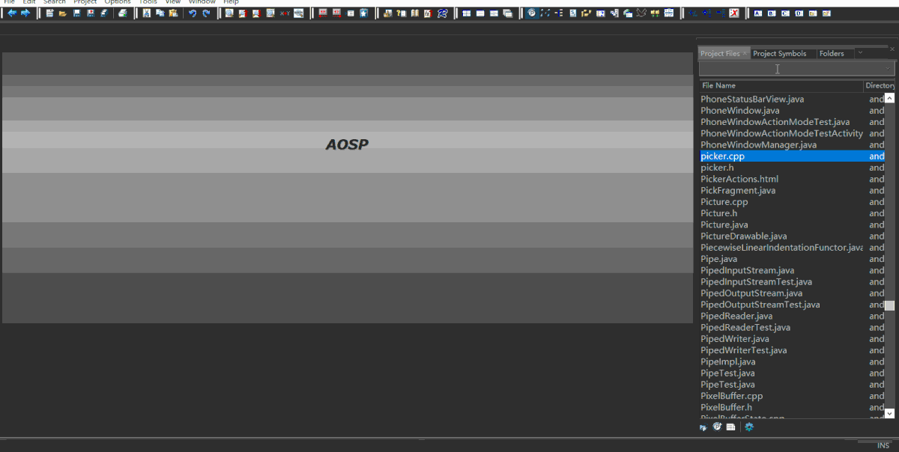
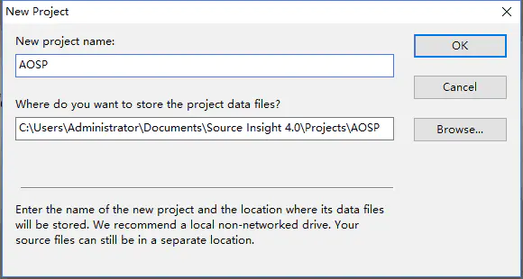
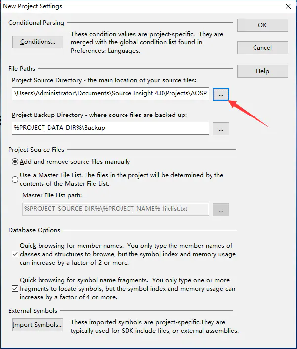
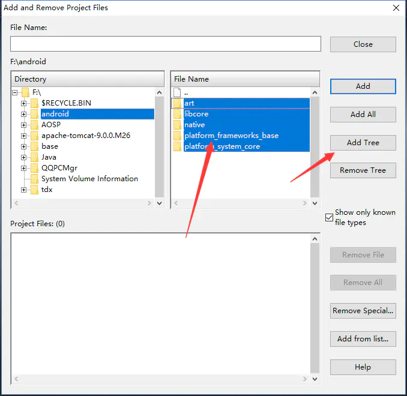
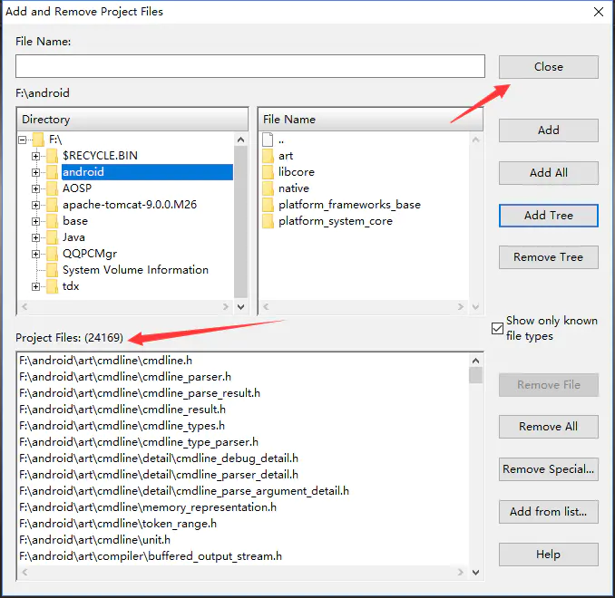
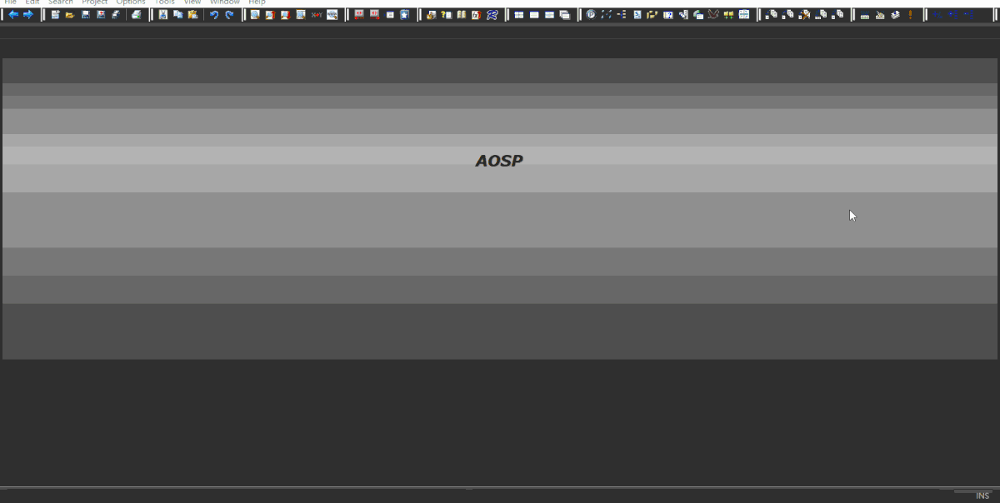
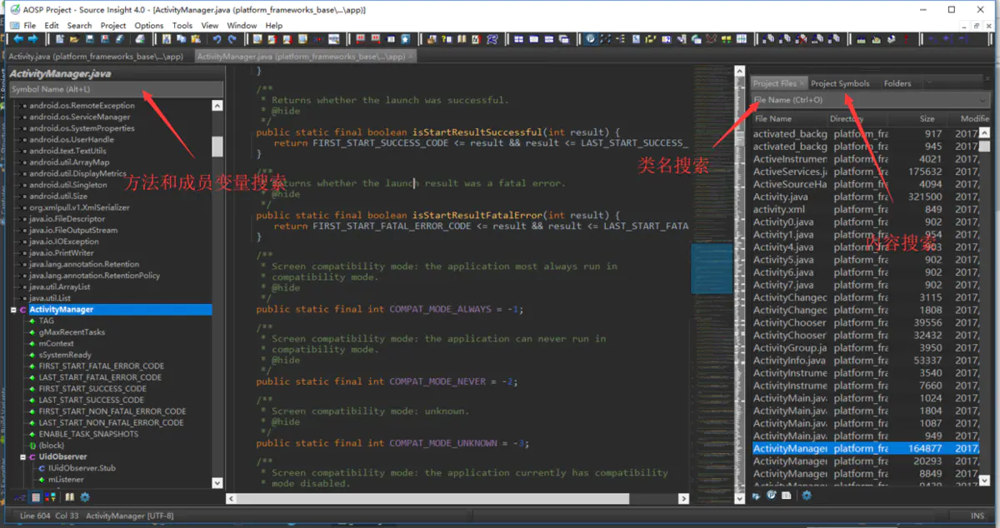
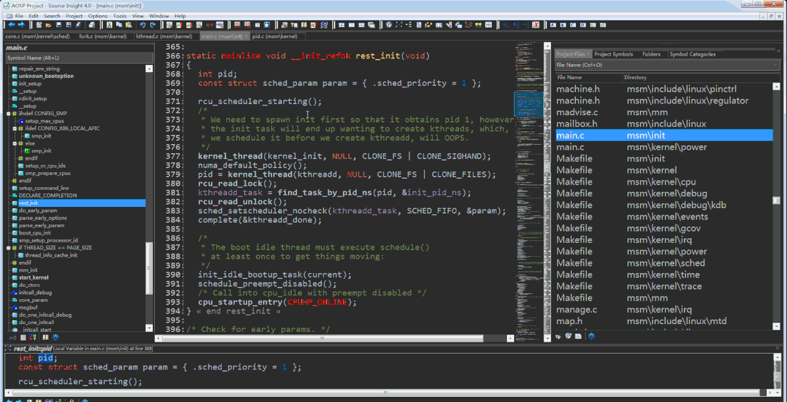
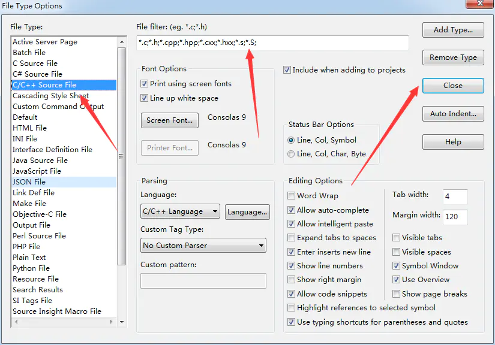
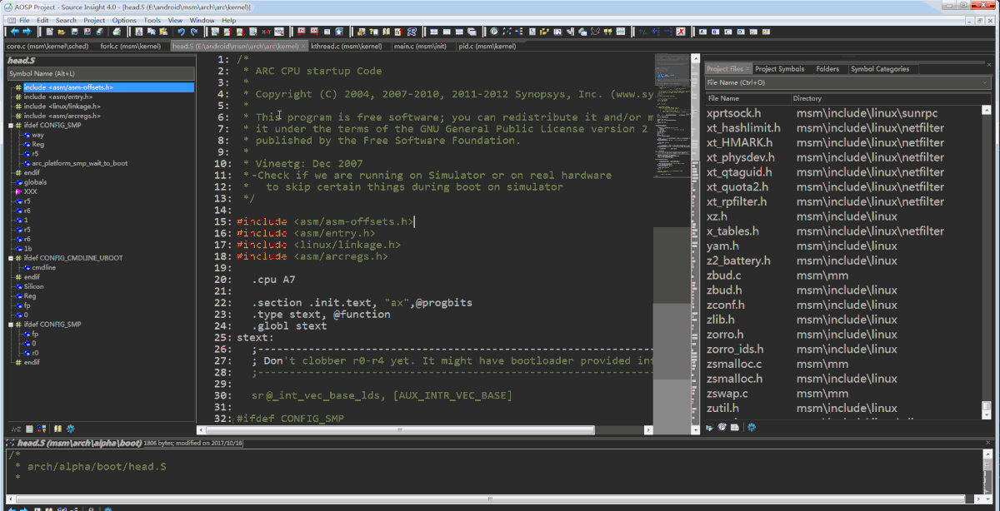

## 如何下载和阅读ASOP源码

单纯的App开发，时间久了，想要进阶，就会碰到这个问题，很多不理解的地方，

AMS到底是什么，PMS做什么用的，APK安装到底做了哪些动作，一切的一切都在源码里，

作为一个Android开发，应该很庆幸，Android的代码是开源的，至少大部分是。

记住这一句：*Read the Fucking* Source *Code* 

那么如何下载，阅读Android源码

### 如何下载

源码下载是我们分析源码的开始，Android源码可以全量下载，也可以单个下载，我们先介绍全量下载

#### 全量下载

[官方文档](https://link.jianshu.com?t=https%3A%2F%2Fsource.android.com%2Fsource%2Fdownloading) ，只要按照上面一步步做就可以了，但是由于需要翻墙，国内无法直接访问，而整个Android项目源码巨大，即便是翻墙后下载也很慢，所以还是使用国内镜像比较好。

我推荐清华大学开源镜像，[地址](https://link.jianshu.com?t=https%3A%2F%2Fmirrors.tuna.tsinghua.edu.cn%2Fhelp%2FAOSP%2F) ，这上面也是有完整的教程，我就不复制粘贴了，但是有一点要注意，你一定要备一个比较大的磁盘，至少60个G吧，还不算后期编译的。

我们分析源码其实是不需要全部代码的，因为AOSP不仅包括系统源码，还有些工具代码，如aapt，adb等，这些我们根本不需要，而且即便是系统源码，也不是所有我们都需要看，如果真的全部看，你这辈子都看不完，所以我还是推荐大家单个下载。

#### 单个下载

[官方地址](https://link.jianshu.com?t=https%3A%2F%2Fandroid.googlesource.com%2F) ，比如我们要下载platform/frameworks/base/目录下的代码，我们可以git clone [https://android.googlesource.com/platform/frameworks/base](https://link.jianshu.com?t=https%3A%2F%2Fandroid.googlesource.com%2Fplatform%2Fframeworks%2Fbase) ，不过这个还是会遇到翻墙的问题，当然我们也可以用镜像。

[镜像地址](https://link.jianshu.com?t=https%3A%2F%2Faosp.tuna.tsinghua.edu.cn%2F) ，比如我们要下载platform/frameworks/base/目录，就用git clone [https://aosp.tuna.tsinghua.edu.cn/platform/frameworks/base](https://link.jianshu.com?t=https%3A%2F%2Faosp.tuna.tsinghua.edu.cn%2Fplatform%2Fframeworks%2Fbase) ，如果你带宽够的话，一般几分钟就可以下载好你想要的单个源码了。

如果你想下载单个文件，或者搜索文件名及代码，可以访问 [http://androidxref.com/](https://link.jianshu.com?t=http%3A%2F%2Fandroidxref.com%2F) ，这里有部分Android的源码

#### 部分源码目录功能

| ANDROID源码根目录 | 描述                                               |
| :---------------- | :------------------------------------------------- |
| abi               | 应用程序二进制接口                                 |
| art               | 全新的ART运行环境( Android运行时库 )               |
| bionic            | 系统C库                                            |
| bootable          | 启动引导相关代码                                   |
| build             | 存放系统编译规则及generic等基础开发包配置          |
| cts               | Android兼容性测试套件标准                          |
| dalvik            | dalvik虚拟机                                       |
| developers        | 开发者目录                                         |
| development       | 应用程序开发相关                                   |
| device            | 设备相关配置                                       |
| docs              | 参考文档目录                                       |
| external          | 开源模组相关文件                                   |
| frameworks        | 应用程序框架，Android系统核心部分，由Java和C++编写 |
| hardware          | 主要是硬件抽象层的代码                             |
| libcore           | 核心库相关文件                                     |
| libnativehelper   | 动态库，实现JNI库的基础                            |
| ndk               | NDK相关代码，帮助开发人员在应用程序中嵌入C/C++代码 |
| out               | 编译完成后代码输出在此目录                         |
| packages          | 应用程序包                                         |
| pdk               | Plug Development Kit 的缩写，本地开发套件          |
| platform_testing  | 平台测试                                           |
| prebuilts         | x86和arm架构下预编译的一些资源                     |
| sdk               | sdk和模拟器                                        |
| system            | 底层文件系统库、应用和组件                         |
| toolchain         | 工具链文件                                         |
| tools             | 工具文件                                           |
| Makefile          | 全局Makefile文件，用来定义编译规则                 |

##### 应用层部分

位于整个Android系统的最上层，系统核心应用程序、第三方的应用程序和输入法等都是在应用层。源码根目录中的packages目录对应着系统应用层

| PACKAGES目录 | 描述           |
| :----------- | :------------- |
| apps         | 核心应用程序   |
| experimental | 第三方应用程序 |
| inputmethods | 输入法目录     |
| providers    | 内容提供者目录 |
| screensavers | 屏幕保护       |
| services     | 通信服务       |
| wallpapers   | 墙纸           |

##### 应用框架层部分

系统的核心部分，一方面向上提供接口给应用层调用，另一方面向下与C/C++程序库以及硬件抽象层等进行衔接，主要实现代码在/frameworks/base和/frameworks/av目录下

| /FRAMEWORKS/BASE目录 | 描述          | /FRAMEWORKS/BASE目录 | 描述                      |
| :------------------- | :------------ | :------------------- | :------------------------ |
| api                  | 定义API       | cmds                 | 重要命令：am、app_proce等 |
| core                 | 核心库        | data                 | 字体和声音等数据文件      |
| docs                 | 文档          | graphics             | 图形图像相关              |
| include              | 头文件        | keystore             | 和数据签名证书相关        |
| libs                 | 库            | location             | 地理位置相关库            |
| media                | 多媒体相关库  | native               | 本地库                    |
| nfc-extras           | NFC相关       | obex                 | 蓝牙传输                  |
| opengl               | 2D/3D 图形API | packages             | 设置、TTS、VPN程序        |
| sax                  | XML解析器     | services             | 系统服务                  |
| telephony            | 电话通讯管理  | test-runner          | 测试工具相关              |
| tests                | 测试相关      | tools                | 工具                      |
| wifi                 | wifi无线网络  |                      |                           |

##### C/C++程序库部分

C/C++程序库的类型繁多，功能强大，并不完全在一个目录中

| 目录位置                                   | 描述                                             |
| :----------------------------------------- | :----------------------------------------------- |
| bionic/                                    | Google开发的系统C库，以BSD许可形式开源           |
| /frameworks/av/media                       | 系统媒体库                                       |
| /frameworks/native/opengl                  | 第三方图形渲染库                                 |
| /frameworks/native/services/surfaceflinger | 图形显示库，主要负责图形的渲染、叠加和绘制等功能 |
| external/sqlite                            | 轻量型关系数据库SQLite的C++实现                  |

例如想看Launcher源码，只要下载：packages/apps/Launcher2 即可

到时候需要用到那个类，看下包地址，可以再对应下载，或者直接把主要的目录下载下来

可以参考

| git clone https://aosp.tuna.tsinghua.edu.cn/platform/packages/apps/Launcher2\ |
| ------------------------------------------------------------ |
| git clone https://aosp.tuna.tsinghua.edu.cn/platform/frameworks/base |
| git clone https://aosp.tuna.tsinghua.edu.cn/platform/frameworks/native |
| git clone https://aosp.tuna.tsinghua.edu.cn/platform/system/core |
| git clone https://aosp.tuna.tsinghua.edu.cn/platform/bionic  |
| git clone https://aosp.tuna.tsinghua.edu.cn/platform/libcore |
| git clone https://aosp.tuna.tsinghua.edu.cn/platform/art     |
| git clone https://aosp.tuna.tsinghua.edu.cn/kernel/msm       |

### 如何阅读

当我们把源码下载下来之后，会感到茫然无措，因为AOSP的源码实在是太多了，这里我们需要明确一些问题：

- 要阅读哪些源码
- 阅读源码的顺序和方式
- 用什么工具来阅读

#### 要阅读哪些源码

这个问题是比较个性化的，因为不同的人从事着不同的工作，有的人从事应用开发，可能对Java层东西感兴趣;有的人从事Framework开发，可能对Framework层感兴趣;有的从事硬件开发，可能对底层实现感兴趣。

这个都因人而异，但是有一点，不能盲目地毫无目的地看源码，因为这样的话最终你会淹没在AOSP的大海里，看了一年半截啥都看了，却又感觉都没看透，别人问你源码的东西，都能说个一二，但是一往深了说，就不知所以了。

所以对于AOSP源码，不在于多，而在于精，你不要试图把所有的源码都看懂，你只要对自己感兴趣的那部分深入研究就可以，因为即便是Google工程师也不可能把AOSP全部读完。

对于我而言，我是从事应用层开发的，我主要会了解以下几个方面的源码：

- Android系统启动流程，应用启动流程，四大组件启动流程，这将列入系统启动篇
- 系统常用服务ActivityManagerService,WindowManagerService等，这将列入系统服务篇
- 通信机制，主要是Binder和Handler，这将列入通信篇
- 进程和线程的创建，运行，销毁，这将列入进程篇
- View的绘制和显示流程，事件分发机制，这将列入图形绘制篇
- Android虚拟机ART运行机制，类加载机制，Java注解，Java反射，这将列入虚拟机篇
- Android对于Java集合的优化算法，这将列入Java基础篇

#### 阅读源码的顺序和方式

##### 阅读顺序

读源码是一个日积月累的过程，不可能一蹴而就，当我们列出自己感兴趣的源码后，我们需要制定一个阅读计划，先读什么再读什么。这个也是因人而异，根据自己的兴趣来就是，你最想读什么，那就排前面。

我一直在说兴趣，因为兴趣是最好的老师，只有你对一样东西感兴趣了，才会有动力去学，去研究，才会不觉得累，如果一开始就去啃一些你不感兴趣的东西，到头来也是乏味不专注的，理解的程度也是不深，而且很有可能失去信心，最后放弃阅读。

当然，如果你对好几样东西都感兴趣，那就有一些原则了：

- 事物都讲究先后，就像树木扎根大地一样，先有大地，才有树木，基础的东西先看
- 相互有关联的东西一起看，不要一会儿看系统启动，突然又去看事件分发什么的

#####  阅读方式

Android系统涵盖的范围很广，从上层的应用程序，到Framework，再到Libraries以至硬件，从Java层到C++，就像一座几十层的大厦一样，每层都有楼梯，也有电梯，我们需要做的就是在大厦里上下穿梭。

当我们阅读某一个知识点源码的时候，不同的知识点有不同的阅读方式，有些适合从下往上读，比如系统启动流程，我是从事件开始的地方开始读，从init.cpp开始，然后到zygote进程，到Java虚拟机，最后到Luncher；

有些适合从上往下读，比如Activity的启动，我是从startActivity方法开始读，然后到ActivityThread，然后到ActivityManagerService;

有些适合两头从中间读，比如Binder,我是从Java层看到C++层，但是看到驱动那儿看不动了，然后就从接收Binder的地方往回看，最后在两端集中在驱动的地方前后对比，才将Binder看通。

这里还是有个好的方式，就是从事件触发的地方开始看是比较合适的。

#### 用什么工具来阅读

Android 源码阅读神器当然是Source Insight

Source Insight的好处：

- 支持方法跳转，类跳转，并且对C++支持很好
- 支持文件搜索，java,c++，xml都支持，并且支持内容搜索
- 支持一键导入，随时配置路径
- 而且最重要的，导入文件数多的时候不卡

##### 如何使用Source Insight

###### 安装

下载地址 [http://download.csdn.net/download/foxlee1991/9882553](https://link.jianshu.com?t=http%3A%2F%2Fdownload.csdn.net%2Fdownload%2Ffoxlee1991%2F9882553) ，

可以专门配置了一个跟Android Studio一样的Darcula主题，下载地址 [http://download.csdn.net/download/foxlee1991/9882535](https://link.jianshu.com?t=http%3A%2F%2Fdownload.csdn.net%2Fdownload%2Ffoxlee1991%2F9882535)

###### 导入源码

我目前还没有下载完整的AOSP源码，只是先下载了几个重要的源码。打开Source Insight,选择Project -> New Project，取个名字比如叫AOSP，点击OK

选择你要查看的源码目录，点击OK

选择需要将哪些目录下的源码导入，点击Add Tree

导入成功后会有很多文件列在下方，点击Close

###### 查看源码

现在进入项目还是一片空白，需要把工具栏打开，然后就可以看源码了

左边是方法和成员变量搜索，右边Project File是搜索类名，Project Symbol是内容搜索

还有一些快捷键，比如Ctrl+左键可以方法跳转，左上角有前进和后退，Ctrl+G 是跳转到指定行，Ctrl+F 搜索内容，有时我们会遇到方法无法跳转，这时我们需要点击Project，选择Synchronize Files,全局关联一下，如图

这里要注意导入的文件不要太多，太多会导致Synchronize失败，我们可以选择性地导入一些目录

我们在导入源码的时候，有时一些汇编的源码(以.s或.S结尾)无法导入，这时我们需要点击Options，选择File Type Options，在C/C++里添加.s和.S的支持，然后Close，如图

然后我们重新追加一些目录，点击Project，选择Add and Remove Projec Files，选择对应目录Add Tree即可，同时我们也可以选择Remove Tree删除对应目录源码，操作如下

### 补充

在真正开始阅读Android源码之前，最好是去了解一些C/C++的语法知识，因为源码核心的部分都是用C/C++写的，如果你对一些基础语法不太了解，会看得云里雾里的，这里我给大家推荐两本书[《C标准库 中文版》](https://link.jianshu.com?t=http%3A%2F%2Fdownload.csdn.net%2Fdownload%2Ffoxlee1991%2F10033921)和[《C++标准库 中文第2版》](https://link.jianshu.com?t=http%3A%2F%2Fdownload.csdn.net%2Fdownload%2Ffoxlee1991%2F10034335)，另外一些学习网站也不错：

- [微软官方](https://link.jianshu.com?t=https%3A%2F%2Fmsdn.microsoft.com%2Fzh-cn%2Flibrary%2Fcscc687y.aspx)
- [菜鸟教程](https://link.jianshu.com?t=http%3A%2F%2Fwww.runoob.com%2Fcplusplus%2Fcpp-tutorial.html)
- [W3Cschool](https://link.jianshu.com?t=https%3A%2F%2Fwww.w3cschool.cn%2Fcpp%2F)

参考文章

[掌握Android阅读源码的两种简单方](https://juejin.im/post/6844904175109668878)

[Android系统源码目录](http://www.chaofen.online/article/2020/2/14/8.html)

[如何下载和阅读Android源码](https://www.jianshu.com/p/14ade986d3a8)